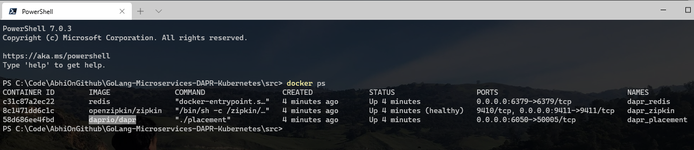

# Installation of DAPR (Distributed Application Runtime)
An event-driven, portable runtime for building microservices on cloud and edge.

## Installing DAPR CLI on *Windows*

1) Open Windows Powershell
2) Run
   
```cmd
Set-ExecutionPolicy RemoteSigned -scope CurrentUser
```

3) Run 

``` cmd
powershell -Command "iwr -useb https://raw.githubusercontent.com/dapr/cli/master/install/install.ps1 | iex"
```

output -


## Installing DAPR CLI on *Linux*
Install the latest linux Dapr CLI to /usr/local/bin

```cmd
wget -q https://raw.githubusercontent.com/dapr/cli/master/install/install.sh -O - | /bin/bash
```
## Installing DAPR CLI on *MacOS*

Install the latest darwin Dapr CLI to /usr/local/bin

```cmd
curl -fsSL https://raw.githubusercontent.com/dapr/cli/master/install/install.sh | /bin/bash
```

Or install via Homebrew

```cmd
brew install dapr/tap/dapr-cli
```

## Installing Dapr in self hosted mode
**Initialize Dapr using the CLI**
By default, during initialization the Dapr CLI will install the Dapr binaries as well as setup a developer environment to help you get started easily with Dapr. This environment uses Docker containers, therefore Docker is listed as a prerequisite.

```cmd
dapr init
```


To see that Dapr has been installed successfully, from a command prompt run the **docker ps** command and check that the daprio/dapr:latest and redis container images are both running.




## On Kubernetes Clusters

When setting up Kubernetes, you can do this either via the Dapr CLI or Helm.

Dapr installs the following pods:

* dapr-operator: Manages component updates and kubernetes services endpoints for Dapr (state stores, pub-subs, etc.)
* dapr-sidecar-injector: Injects Dapr into annotated deployment pods
* dapr-placement: Used for actors only. Creates mapping tables that map actor instances to pods
* dapr-sentry: Manages mTLS between services and acts as a certificate authority