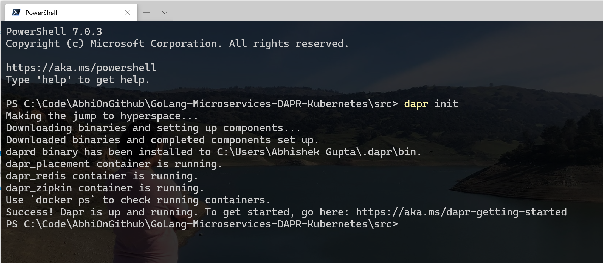

# Installation of DAPR (Distributed Application Runtime)
An event-driven, portable runtime for building microservices on cloud and edge.

## Installing DAPR CLI on *Windows*

1) Open Windows Powershell
2) Run
   
```cmd
Set-ExecutionPolicy RemoteSigned -scope CurrentUser
```

3) Run 

``` cmd
powershell -Command "iwr -useb https://raw.githubusercontent.com/dapr/cli/master/install/install.ps1 | iex"
```

output -


<hr/>

## Installing DAPR CLI on *Linux*
Install the latest linux Dapr CLI to /usr/local/bin

```cmd
wget -q https://raw.githubusercontent.com/dapr/cli/master/install/install.sh -O - | /bin/bash
```

<hr/>

## Installing DAPR CLI on *MacOS*

Install the latest darwin Dapr CLI to /usr/local/bin

```cmd
curl -fsSL https://raw.githubusercontent.com/dapr/cli/master/install/install.sh | /bin/bash
```

Or install via Homebrew

```cmd
brew install dapr/tap/dapr-cli
```
<hr/>

## Installing Dapr in self hosted mode
**Initialize Dapr using the CLI**
By default, during initialization the Dapr CLI will install the Dapr binaries as well as setup a developer environment to help you get started easily with Dapr. This environment uses Docker containers, therefore Docker is listed as a prerequisite.

```cmd
dapr init
```


To see that Dapr has been installed successfully, from a command prompt run the **docker ps** command and check that the daprio/dapr:latest and redis container images are both running.


<hr/>

## On Kubernetes Clusters

When setting up Kubernetes, you can do this either via the Dapr CLI or Helm.

Dapr installs the following pods:

* dapr-operator: Manages component updates and kubernetes services endpoints for Dapr (state stores, pub-subs, etc.)
* dapr-sidecar-injector: Injects Dapr into annotated deployment pods
* dapr-placement: Used for actors only. Creates mapping tables that map actor instances to pods
* dapr-sentry: Manages mTLS between services and acts as a certificate authority

## Set up an Azure Kubernetes Service cluster

## Prerequisites

- [Docker](https://docs.docker.com/install/)
- [kubectl](https://kubernetes.io/docs/tasks/tools/install-kubectl/)
- [Azure CLI](https://docs.microsoft.com/en-us/cli/azure/install-azure-cli?view=azure-cli-latest)

## Deploy an Azure Kubernetes Service cluster

This section walks you through installing an Azure Kubernetes Service (AKS) cluster. 

1. Login to Azure

```bash
az login
```

2. Set the default subscription

```bash
az account set -s [your_subscription_id]
```

3. Create a resource group

```bash
az group create --name [your_resource_group] --location [region]
```

4. Create an Azure Kubernetes Service cluster

Use 1.13.x or newer version of Kubernetes with `--kubernetes-version`

```bash
az aks create --resource-group [your_resource_group] --name [your_aks_cluster_name] --node-count 2 --kubernetes-version 1.17.9 --enable-addons http_application_routing --enable-rbac --generate-ssh-keys
```

This is how I got my K8s Instance (AKS) provisioned on Azure


Get the access credentials for the Azure Kubernetes cluster

```bash
az aks get-credentials -n [your_aks_cluster_name] -g [your_resource_group]
```


<hr/>

## (optional) Install Helm v3

Install Helm v3 client

```cmd
choco install kubernetes-helm
```
In case you need permissions the kubernetes dashboard (i.e. configmaps is forbidden: User "system:serviceaccount:kube-system:kubernetes-dashboard" cannot list configmaps in the namespace "default", etc.) execute this command

```bash
kubectl create clusterrolebinding kubernetes-dashboard -n kube-system --clusterrole=cluster-admin --serviceaccount=kube-system:kubernetes-dashboard
```

for me it already exists as shown below :


<hr/>

## Install Dapr to Kubernetes **(AKS)**

1. Make sure Helm 3 is installed on your machine

2. Add Azure Container Registry as a Helm repo

```bash
helm repo add dapr https://daprio.azurecr.io/helm/v1/repo
helm repo update
```

3. Create `dapr-system` namespace on your kubernetes cluster

```bash
kubectl create namespace dapr-system
```

4. Install the Dapr chart on your cluster in the `dapr-system` namespace.

```bash
helm install dapr dapr/dapr --namespace dapr-system
```

### Verify installation

Once the chart installation is complete, verify the dapr-operator, dapr-placement, dapr-sidecar-injector and dapr-sentry pods are running in the `dapr-system` namespace:

```bash
$ kubectl get pods -n dapr-system -w

NAME                                     READY     STATUS    RESTARTS   AGE
dapr-operator-7bd6cbf5bf-xglsr           1/1       Running   0          40s
dapr-placement-7f8f76778f-6vhl2          1/1       Running   0          40s
dapr-sidecar-injector-8555576b6f-29cqm   1/1       Running   0          40s
dapr-sentry-9435776c7f-8f7yd             1/1       Running   0          40s
```

### Sidecar annotations

To see all the supported annotations for the Dapr sidecar on Kubernetes, visit [this](../howto/configure-k8s/README.md) how to guide.

#### Uninstall Dapr on Kubernetes

Helm 3

```bash
helm uninstall dapr -n dapr-system