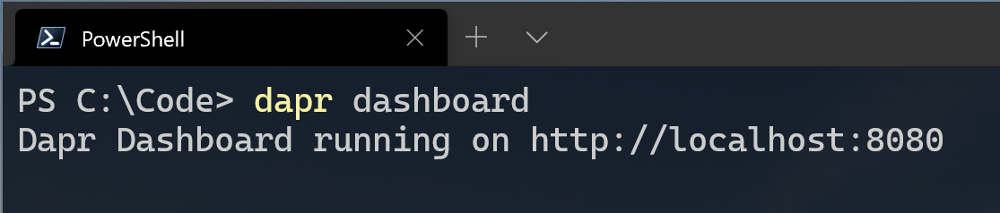
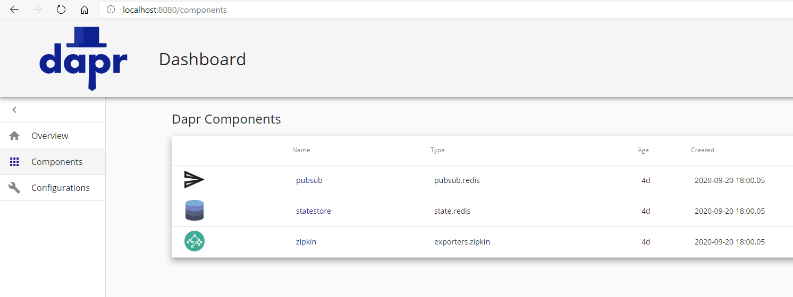

# Writing Simple ASP.net App/Program using DAPR

## ( **D**istributed **AP**plication **R**untime )

## Basic DAPR Terminology

* **Dapr CLI** is a cross-platform command-line tool that you can use to configure, manage, and monitor your Dapr instances. It also provides access to useful tools such as the Dapr dashboard.

* **Dapr host** hosts an instance of the Dapr runtime. The most common form is a Docker container, which is injected into a pod to run side by side with user code on Kubernetes.4 Dapr can also run in standalone mode as a service process or a daemon, it implements communication protocols such as HTTP and gRPC.

* **Dapr API**  defines the programmable interface to the Dapr runtime.5

* **Dapr runtime** implements the Dapr API. It’s the core of Dapr’s functionality.

* **Dapr operator** is a Kubernetes-specific component that supports Dapr’s Kubernetes mode. It manages configurations and bindings, which are implemented as Kubernetes custom resources.

* **Dapr sidecar injector** handles Dapr sidecar container injection when Dapr runs in Kubernetes mode.

There are few more DAPR terms and concepts which we will understand in more advance topics.

<hr/>

### Lets start Hands-On

You can use DAPR in **self hosted mode** or on your **Kubernetes cluster**,
In this exercise we will focus mainly on Self Hosted Mode

1) Uninstall DAPR if you want fresh start (although not mandatory)

```cmd
dapr uninstall
```
or if you want to uninstall from your Kubernetes cluster
```cmd
dapr uninstall -k
```


<hr/>

2) Init DAPR

```cmd
dapr init
```
or if you want to install it to your kubernetes cluster

```cmd
dapr init -k
```


<hr/>

3) Check the status of Dapr

```cmd
dapr status
```

or if you want to see the status of DAPR on your K8s cluster

```cmd
dapr init -k
```


4) Get List of Containers running by DAPR

```cmd
docker ps
```


<hr/>

1) Write a Simple ASP.net MVC REST API to do following
   * a) Create a Customer , Delete a Customer, Get Customer
   * b) Create a Account and assign it to a Custmer
   * c) Perform Transaction (Deposit , Withdraw)

Create file **AccountController.cs** inside Controllers folder and write following code

```C#
using Accounting.Models;
using Dapr;
using Dapr.Client;
using Microsoft.AspNetCore.Mvc;
using System.Collections.Generic;
using System.Threading.Tasks;

namespace Accounting.Controllers
{
    /// <summary>
    /// Transaction controller.
    /// </summary>
    [ApiController]
    [Route("/api/account/")]
    public class AccountController : ControllerBase
    {
        public const string StoreName = "statestore";

        /// <summary>
        /// add a new customer account
        /// </summary>
        /// <param name="id">Customer id.</param>
        /// <param name="daprClient">State client to interact with Dapr runtime.</param>
        /// <returns>A <see cref="Task{TResult}"/> representing the result of the asynchronous operation.</returns>
        ///  "pubsub", the first parameter into the Topic attribute, is name of the default pub/sub configured by the Dapr CLI.
        [Topic("pubsub", "addaccount")]
        [HttpPost]
        public async Task<ActionResult<Customer>> AddCustomerAccount(Customer customer, [FromServices] DaprClient daprClient)
        {
            var state = await daprClient.GetStateEntryAsync<Customer>(StoreName, customer.Id);
            if (state == null || state.Value == null)
            {
                return this.BadRequest($"Customer with Id {customer.Id} doesn't exists");
            }
            
            if(state.Value.Accounts == null)
            {
                state.Value.Accounts = new List<Account>();
            }
            state.Value.Accounts.Add(new Account(){ Id = $"ac-{state.Value.Accounts.Count}-{customer.Id}",Balance = 0 });
            await state.SaveAsync();
            return state.Value;
        }
    }
}
```

Create file **CustomerController.cs** inside Controllers folder and write following code

```C#
using Accounting.Models;
using Dapr;
using Dapr.Client;
using Microsoft.AspNetCore.Mvc;
using System.Collections.Generic;
using System.Threading.Tasks;

namespace Accounting.Controllers
{
    /// <summary>
    /// Transaction controller.
    /// </summary>
    [ApiController]
    [Route("/api/customer/")]
    public class CustomerController : ControllerBase
    {
        public const string StoreName = "statestore";

        /// <summary>
        /// check account balance as specified by account id.
        /// </summary>
        /// <param name="account">Account information for the id from Dapr state store.</param>
        /// <returns>Account information.</returns>
        [HttpGet("{id}")]
        public async Task<ActionResult<Customer>> Get(string id, [FromServices] DaprClient daprClient)
        {
            var state = await daprClient.GetStateEntryAsync<Customer>(StoreName, id);
            if (state == null || state.Value == null)
            {
                return this.BadRequest($"Customer with Id {id} doesn't exists");
            }

            return state.Value;
        }

        /// <summary>
        /// add a new customer
        /// </summary>
        /// <param name="customer">Customer info.</param>
        /// <param name="daprClient">State client to interact with Dapr runtime.</param>
        /// <returns>A <see cref="Task{TResult}"/> representing the result of the asynchronous operation.</returns>
        ///  "pubsub", the first parameter into the Topic attribute, is name of the default pub/sub configured by the Dapr CLI.
        [Topic("pubsub", "addcustomer")]
        [HttpPost]
        public async Task<ActionResult<Customer>> AddCustomer(Customer customer, [FromServices] DaprClient daprClient)
        {
            var state = await daprClient.GetStateEntryAsync<Customer>(StoreName, customer.Id);
            if (state !=null && state.Value != null)
            {
                return this.BadRequest($"Customer with Id {state.Value.Id} already exists");
            }
            state.Value = new Customer()
            {
                Id = customer.Id,
                Accounts = new List<Account>(), // Account will be assigned to this customer later
                Name = customer.Name,
                Address = customer.Address,
                Phone = customer.Phone
            };
            await state.SaveAsync();
            return state.Value;
        }

        /// <summary>
        /// add a new customer
        /// </summary>
        /// <param name="customer">Customer info.</param>
        /// <param name="daprClient">State client to interact with Dapr runtime.</param>
        /// <returns>A <see cref="Task{TResult}"/> representing the result of the asynchronous operation.</returns>
        ///  "pubsub", the first parameter into the Topic attribute, is name of the default pub/sub configured by the Dapr CLI.
        [Topic("pubsub", "updatecustomer")]
        [HttpPut]
        public async Task<ActionResult<Customer>> UpdateCustomer(Customer customer, [FromServices] DaprClient daprClient)
        {
            var state = await daprClient.GetStateEntryAsync<Customer>(StoreName, customer.Id);
            if (state == null || state?.Value == null)
            {
                return this.BadRequest($"Customer with Id {customer.Id} doesn't exists");
            }
            else
            {
                //Ideally only these 3 details of a customer should be updated from here
                state.Value.Name = customer.Name;
                state.Value.Address = customer.Address;
                state.Value.Phone = customer.Phone;

                await state.SaveAsync();
                return state.Value;
            }
        }

        /// <summary>
        /// delete a existing customer
        /// </summary>
        /// <param name="customer">Customer info.</param>
        /// <param name="daprClient">State client to interact with Dapr runtime.</param>
        /// <returns>A <see cref="Task{TResult}"/> representing the result of the asynchronous operation.</returns>
        ///  "pubsub", the first parameter into the Topic attribute, is name of the default pub/sub configured by the Dapr CLI.
        [Topic("pubsub", "deletecustomer")]
        [HttpDelete("{id}")]
        public async Task<ActionResult<string>> DeleteCustomer(string id, [FromServices] DaprClient daprClient)
        {
            var state = await daprClient.GetStateEntryAsync<Customer>(StoreName, id);
            if (state == null || state?.Value == null)
            {
                return this.BadRequest($"Customer with Id {id} doesn't exists");
            }
            else
            {
                if (state.Value.Accounts?.Count > 0)
                    return this.BadRequest($"First delete/close the {state.Value.Accounts.Count} accounts of Customer with Id {id}");
                else
                {    
                    await state.DeleteAsync();
                    return $"Deleted the Customer with Id {id}";
                }
            }
        }
    }
}
```

Create file **TransactionController.cs** inside Controllers folder and write following code

```C#
using System.Threading.Tasks;
using Accounting.Models;
using Dapr;
using Dapr.Client;
using Microsoft.AspNetCore.Mvc;

namespace Accounting.Controllers
{
    /// <summary>
    /// Transaction controller.
    /// </summary>
    [ApiController]
    [Route("/api/transaction/")]
    public class TransactionController : ControllerBase
    {
        public const string StoreName = "statestore";

        /// <summary>
        /// check account balance as specified by account id.
        /// </summary>
        /// <param name="account">Account information for the id from Dapr state store.</param>
        /// <returns>Account information.</returns>
        [HttpGet("checkbalance/{account}")]
        public ActionResult<Account> Get([FromState(StoreName)]StateEntry<Account> account)
        {
            if (account.Value is null)
            {
                return this.NotFound();
            }

            return account.Value;
        }

        /// <summary>
        /// Deposit to account as specified in transaction.
        /// </summary>
        /// <param name="transaction">Transaction info.</param>
        /// <param name="daprClient">State client to interact with Dapr runtime.</param>
        /// <returns>A <see cref="Task{TResult}"/> representing the result of the asynchronous operation.</returns>
        ///  "pubsub", the first parameter into the Topic attribute, is name of the default pub/sub configured by the Dapr CLI.
        [Topic("pubsub", "deposit")]
        [HttpPost("deposit")]
        public async Task<ActionResult<Account>> Deposit(Transaction transaction, [FromServices] DaprClient daprClient)
        {
            var state = await daprClient.GetStateEntryAsync<Account>(StoreName, transaction.Id);
            if (state ==null || state.Value == null)
            {
                return this.BadRequest($"Account with Id {transaction.Id} doesn't exists");
            }
            else
            {
                state.Value.Balance += transaction.Amount;
                await state.SaveAsync();
                return state.Value;
            }
        }

        /// <summary>
        /// Method for withdrawing from account as specified in transaction.
        /// </summary>
        /// <param name="transaction">Transaction info.</param>
        /// <param name="daprClient">State client to interact with Dapr runtime.</param>
        /// <returns>A <see cref="Task{TResult}"/> representing the result of the asynchronous operation.</returns>
        ///  "pubsub", the first parameter into the Topic attribute, is name of the default pub/sub configured by the Dapr CLI.
        [Topic("pubsub", "withdraw")]
        [HttpPost("withdraw")]
        public async Task<ActionResult<Account>> Withdraw(Transaction transaction, [FromServices] DaprClient daprClient)
        {
            var state = await daprClient.GetStateEntryAsync<Account>(StoreName, transaction.Id);
            if (state ==null || state.Value == null)
            {
                return this.BadRequest($"Account with Id {transaction.Id} doesn't exists");
            }
            else
            {
                state.Value.Balance -= transaction.Amount;
                await state.SaveAsync();
                return state.Value;
            }
        }
    }
}
```


You can also refer the source code inside **src/DotNetSamples/Accounting** folder of this repo

<hr/>

6) Now from the same location where Accounting.csproj is present , run following command

```cmd
dapr run --app-id accounting --app-port 5000  dotnet run
```

<hr/>

7) Open your accounting.http file in VSCode and try the endpoints inside it , you will get the response
If you want to fire HTTP Requests from VSCode you need this Plugin https://marketplace.visualstudio.com/items?itemName=humao.rest-client
else try from Postman https://www.postman.com/


If you want to **Debug** your Micorservice running on DAPR via VSCode then install this plugin https://marketplace.visualstudio.com/items?itemName=ms-azuretools.vscode-dapr

<hr/>

8) Finally you can see list of DAPR apps running

```cmd
dapr list
```


<hr/>

9) You can also run DAPR Dashboard for monitoring (Learn more about DAPR Dashboard here <https://github.com/dapr/dashboard> )

```cmd
dapr dashboard
```



Now Open http://localhost:8080 to see DAPR Dashboard

