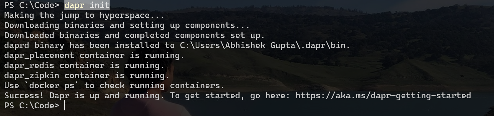
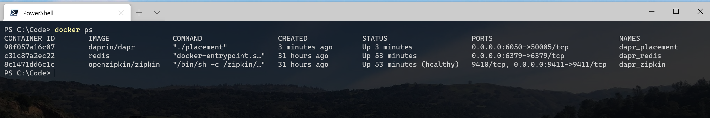

# Writing Simple GoLang App/Program using DAPR

## ( **D**istributed **AP**plication **R**untime )

## Basic DAPR Terminology

* **Dapr CLI** is a cross-platform command-line tool that you can use to configure, manage, and monitor your Dapr instances. It also provides access to useful tools such as the Dapr dashboard.

* **Dapr host** hosts an instance of the Dapr runtime. The most common form is a Docker container, which is injected into a pod to run side by side with user code on Kubernetes.4 Dapr can also run in standalone mode as a service process or a daemon, it implements communication protocols such as HTTP and gRPC.

* **Dapr API**  defines the programmable interface to the Dapr runtime.5

* **Dapr runtime** implements the Dapr API. It’s the core of Dapr’s functionality.

* **Dapr operator** is a Kubernetes-specific component that supports Dapr’s Kubernetes mode. It manages configurations and bindings, which are implemented as Kubernetes custom resources.

* **Dapr sidecar injector** handles Dapr sidecar container injection when Dapr runs in Kubernetes mode.

There are few more DAPR terms and concepts which we will understand in more advance topics.

<hr/>

### Lets start Hands-On

1) Uninstall DAPR if you want fresh start (although not mandatory)

```cmd
dapr uninstall
```


<hr/>

2) Init DAPR

```cmd
dapr init
```



<hr/>

3) Get List of Containers running by DAPR

```cmd
docker ps
```



<hr/>

4) Write a Simple GoLang Program to do following
   * a) Welcome Message at path  /
   * b) Greeting Message at path /greeting
   * c) Greeting by name at path /greetme?name=[YourName]

Create file **main.go** and write following code

```go
package main

import (
	"encoding/json"
	"fmt"
	"log"
	"net/http"
	"time"
)

type incomingEvent struct {
	Data interface{} `json:"data"`
}

func main() {

	http.HandleFunc("/",
		func(w http.ResponseWriter, r *http.Request) {
			fmt.Fprintf(w, "Welcome to first GoLang Web Program running using DAPR! "+time.Now().Format("2006-01-02 15:04:05")) //YYYY-MM-DD hh:mm:ss
		})

	http.HandleFunc("/greeting",
		func(w http.ResponseWriter, r *http.Request) {
			var event incomingEvent
			decoder := json.NewDecoder(r.Body)
			decoder.Decode(&event)
			fmt.Println(event.Data)
			fmt.Fprintf(w, "Welcome, Greetings of the day from DAPR !! "+time.Now().Format("2006-01-02 15:04:05"))
		})

	http.HandleFunc("/greetme",
		func(w http.ResponseWriter, r *http.Request) {
			var event incomingEvent
			decoder := json.NewDecoder(r.Body)
			decoder.Decode(&event)
			fmt.Println(event.Data)

			keys, ok := r.URL.Query()["name"]
			if !ok || len(keys[0]) < 1 {
				log.Println("Url Param 'name' is missing")
				return
			}
			// Query()["key"] will return an array of items,
			// we only want the single item.
			name := keys[0]

			fmt.Fprintf(w, "Welcome "+string(name)+", Greetings of the day from DAPR !! "+time.Now().Format("2006-01-02 15:04:05"))
		})

	log.Fatal(http.ListenAndServe(":8080", nil))
}
```

You can also refer the source code inside **src/GoLangSamples/BasicSample** folder of this repo

<hr/>

5) Now from the same location where main.go is present , run following command

```cmd
dapr run --app-id dapr-greetings --app-port 8080 --port 8089 go run main.go
```
You will see the output as shown below (notice the highlighted command) inside VSCode Integrated Terminal, here we have given the name of our app as **dapr-greetings** and we are running it at port **8088** , while the port of Dapr Sidecar process is **8089**


<hr/>

6) Open your favorite browser and try the three endpoints below
   * a) Welcome Message at path  **/**

	

   * b) Greeting Message at path **/greeting**
	
	

   * c) Greeting by name at path **/greetme?name=[YourName]**

	

<hr/>

7) Finally you can see list of DAPR apps running

```cmd
dapr list
```

