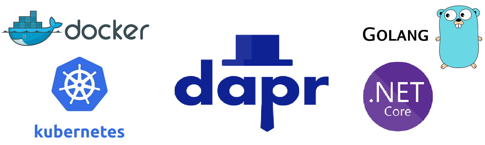

# Learn about Writing GoLang and DotNet Microservices and running them using DAPR on Kubernetes (AKS)
Repository to learn about writing Microservices in GoLang & DotNET and running them as Docker Containers on Kubernetes using DAPR

## We will be learning and using following languages,frameworks and technologies

1) C# and ASP.NET
2) GoLang
3) YAML
4) DAPR (Distributed Application Runtime)
5) Microsoft's Project Tye
6) Docker
7) Kubernetes
8) Azure Kubernetes Service (AKS)
9) Azure Container Registry (ACR)
10) Basic Concepts of Azure (Resource Groups, VNets, VM Scale Sets, RBAC , Storage, Redis, Cosmos)

**Follow : DAPR's Website <https://dapr.io/> and DAPR's Repositories for more details <https://github.com/dapr>**

### Difficulties **without** DAPR

As per DAPR's official Documentation :

* Hard to incrementally migrate from existing code to a microservices architecture.
* Many programming model runtimes have narrow language support and tightly controlled feature sets.
* Event-driven architectures and state handling are complicated making them difficult to scale.
* Many runtimes only target specific infrastructure platforms with limited code portability across clouds and edge.

### What we can achieve **with** DAPR

* Dapr enables developers using any language or framework to easily write microservices, providing industry best practices to solve distributed systems problems.
* Dapr provides consistency and portability through open APIs and extensible components that are community-driven.
* Dapr handles state, resource bindings and pub/sub messaging, which enable event-driven, resilient architectures that scale.
* Dapr is platform agnostic and runs on any infrastructure, including public clouds and edge devices with its open APIs.

Read More about DAPR here <https://github.com/dapr/docs>

### We will also see how we can do some Monitoring through DAPR Dashboard

Dapr Dashboard provides information about Dapr applications, components, configurations, and control plane services. Users can view metadata, manifests and deployment files, actors, logs, and more on both Kubernetes and self-hosted platforms.

Read More about DAPR Dashboard here <https://github.com/dapr/dashboard>

## Index

1) Installation Steps of DAPR and Kubernetes (AKS) ✔️
[Link -> 1-InstallationSteps.md](https://github.com/AbhiOnGithub/GoLang-Microservices-DAPR-Kubernetes/blob/main/1-InstallationSteps.md)

2) Simple **ASP.NET** Web App and run it on Kubernetes (AKS) using DAPR ✔️
[Link -> 2-ASPNetAppOnDAPR.md](https://github.com/AbhiOnGithub/GoLang-Microservices-DAPR-Kubernetes/blob/main/2-ASPNetAppOnDAPR.md)

3) Simple **GoLang** Web App and run it on Kubernetes (AKS) using DAPR ✔️
[Link -> 3-GoLangAppOnDAPR.md](https://github.com/AbhiOnGithub/GoLang-Microservices-DAPR-Kubernetes/blob/main/3-GoLangAppOnDAPR.md)

4) Learning Basic Concepts of Docker ✔️
[Link -> 4-BasicConceptsOfDocker.md](https://github.com/AbhiOnGithub/GoLang-Microservices-DAPR-Kubernetes/blob/main/4-BasicConcetsOfDocker.md)

5) Learning Basic Concepts of Kubernetes (via AKS) 🚧
[Link -> 5-BasicConceptsOfKubernetes.md](https://github.com/AbhiOnGithub/GoLang-Microservices-DAPR-Kubernetes/blob/main/5-BasicConceptsOfKubernetes.md)

6) Learning Advance Concepts of Kubernetes (via AKS) 🚧
[Link -> 6-AdvanceConceptsOfKubernetes.md](https://github.com/AbhiOnGithub/GoLang-Microservices-DAPR-Kubernetes/blob/main/6-AdvanceConceptsOfKubernetes.md)
